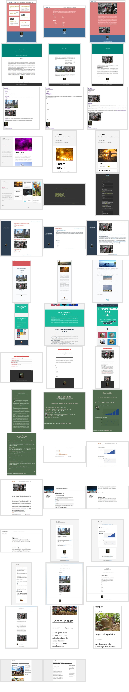

## Themes

* [aluod](aluod/) - A fancy theme that turns lists of content into floating masonry-style cards.
* [barbieri](barbieri/) - A theme with a big hero unit. Good for simple text-only landing pages.
* [base-3-column](base-3-column/) - This is a not a theme. This is just a CSS base to serve as guide to -- or to be directly included in -- themes that may want to create a three-column design on Classless.
* [blank](blank/) - No CSS at all.
* [cyprio](cyprio/) - A theme for sites generated with magical ferrets, unhealthy amounts of coffee.
* [dbyll](dbyll/) - A multipurpose theme with a fixed sidebar.
* [festively](festively/) - A happy theme that goes well with big header pictures.
* [freelancer](freelancer/) - The [Freelancer theme](http://startbootstrap.com/template-overviews/freelancer/) from [Start Bootstrap](http://startbootstrap.com/) adapted to Classless.
* [ghostwriter](ghostwriter/) - A simple blog theme. Better when lists of posts don't bring an excerpt with them.
* [jeen](jeen/) - A green and simple theme.
* [lebo](lebo/) - A minimal theme that uses white backgrounds. Adapted from http://lebo.io/.
* [longform](longform/) - Created by @fiatjaf. Loosely based on the design shown in this blog post: https://signalvnoise.com/posts/2977-behind-the-scenes-highrise-marketing-site-ab-testing-part-1
* [subtle](subtle/) - A simple and minimalist theme that shows a sidebar with header and aside content in it. Better for simple text blogs with not much header images.
* [tacit](tacit/) - The [tacit CSS framework](https://github.com/yegor256/tacit) adapted to the Classless standard.
* [wardrobe](wardrobe/) - A minimal and clean blog theme.

