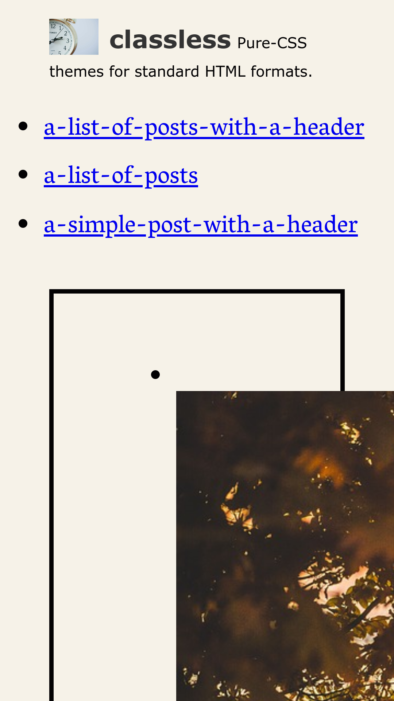
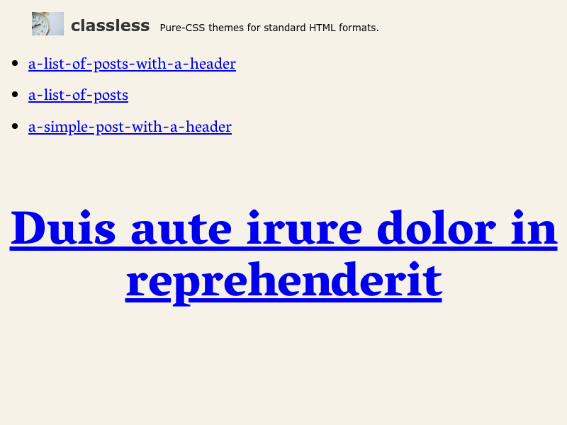
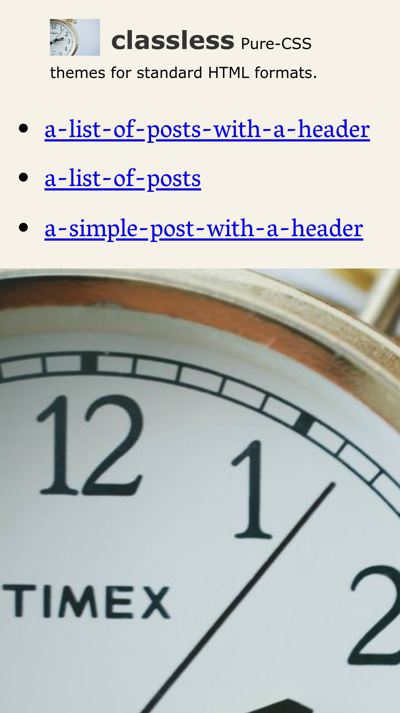
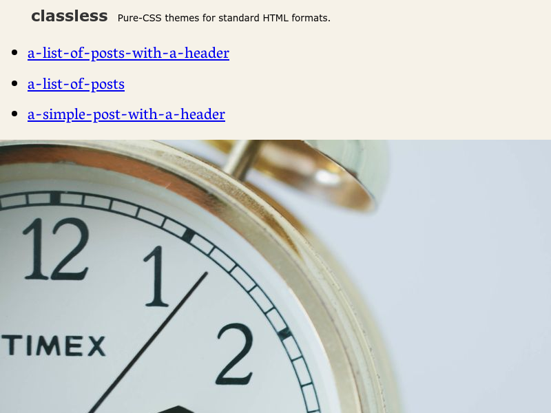

## longform

Created by @fiatjaf. Loosely based on the design shown in this blog post: https://signalvnoise.com/posts/2977-behind-the-scenes-highrise-marketing-site-ab-testing-part-1

Has some special meanings for a series of `<section>`s under `<main>` -- each section in the sequence will be styled differently. This is not very useful for blogs, I think.

---

---

---

---

