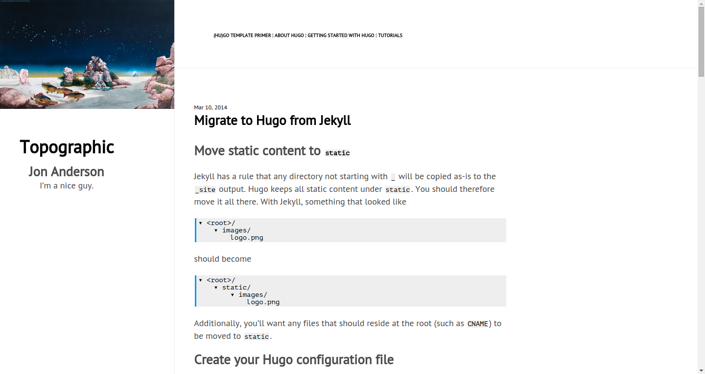
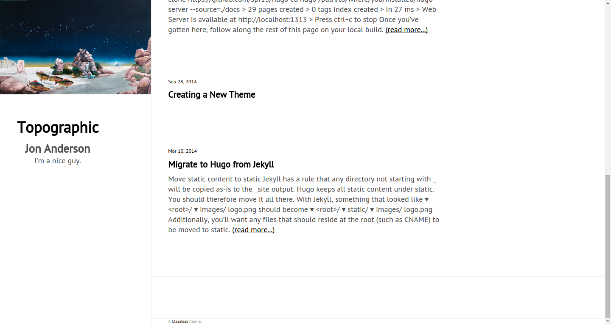
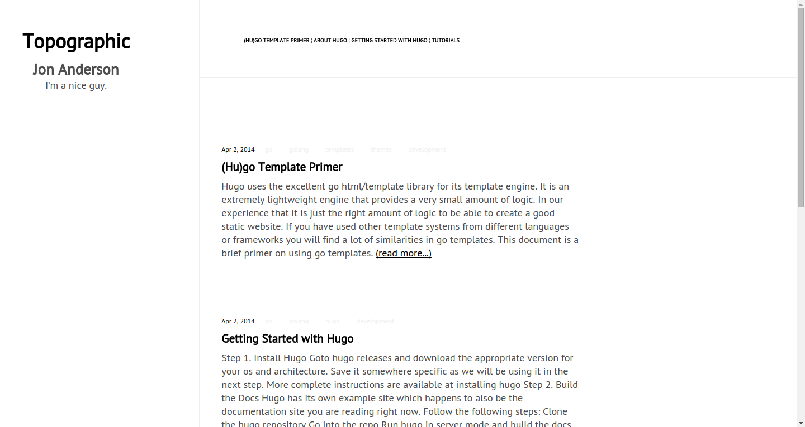

## subtle

A simple and minimalist theme that shows a sidebar with header and aside content in it. Better for simple text blogs with not much header images.
Requires a Javascript file to be included in the page for full functionality.

Based on the original work by @wting and @gfidente on https://github.com/gfidente/pelican-svbhack.

---

---

---

