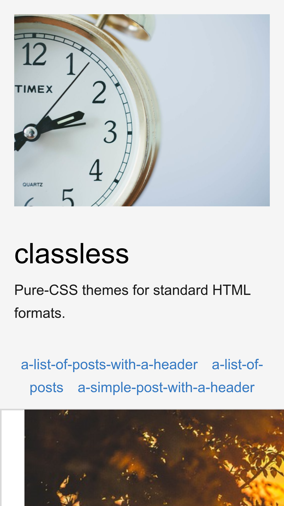
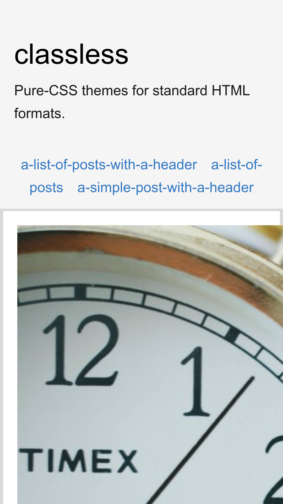

## tacit

The [tacit CSS framework](https://github.com/yegor256/tacit) adapted to the Classless standard.
A very rough and simple layout, enriched by tacit's default HTML styles.

---

---

---

---

